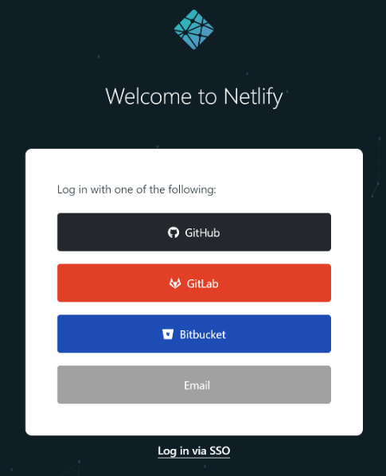
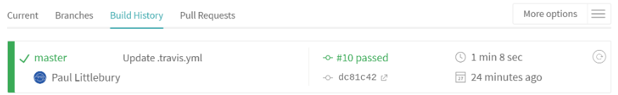

[](https://travis-ci.org/jaffamonkey/starter-github-html-tests-travis-netlify)

_Part of the "zero to vanilla web developer and test engineer" workshop (zero, as in zero prior knowledge)_

# Create a repo on github

Github is a service where you can keep your code, and make it available to others.

Link: https://github.com

After setting up your account, click the "+" symbol in the top-right of the menu bar.


# Fill in repo form

The defaults are ok, but remember to select to add README to add repo info.


# Create first HTML page

After creating repo, click "Create New File"


# Add HTML

After adding the code, click "Commit Changes" at the end of the form to save it 


# Repo

Now your GitHub repo will look like this


# Test Framework

In order to test, we need help from a tool that will enable our JavaScript code to control the browser.

So we are going to create a small framework (inside your repo) to run our test code in.
```
npm install w3c-webdriver
npm install chromedriver
```
Start the chromedriver (now ready to automate browser actions)
```
./node_modules/.bin/chromedriver
```
# The test file

Go back to your GitHub repo and create a new file `test.js`. This code tests opening site and clicking a link.

```
var webdriver = require('w3c-webdriver');
let session;
(async () => {
  try {
    session = await webdriver.newSession('http://localhost:4444', {
      desiredCapabilities: {
        browserName: 'Chrome',
        chromeOptions: {
          args: ["headless", "disable-gpu"]
        }
      }
    });
    await session.go('http://your-netlify-web-address');
    const element = await session.findElement('css selector', 'a');
    await element.click();
  } catch (err) {
    console.log(err.stack);
  } finally {
    session.deleteSession();
  }
})();
```
# To make it easier

The test code is mostly standard setup, so for now the only 3 lines you need to truly understand are

##### Open up url and wait for it to load

`await session.go('http://your-netlify-web-address');`

##### Find the element on web page with tag "a", and give it the name "ëlement"

`const element = await session.findElement('css selector', 'a');`

##### When element has been found, click it

`await element.click();`
# Travis Build Server

Now we have the code, we need the tests to make sure our changes don't break it when we change it.

The tests we currently start manually, but using a build server service, like Travis, these can be run automatically every time you change your code.

You can add this as a step before your code goes to Netlify, to check for test failures.

And you can use your GitHub credentials to login https://travis-ci.org/


# The Travis file

We need to write small configuration file, so that when Travis pulls the code from your GitHub repo, it knows what to do.

The file is very simple for us, so create new file in your repo called `.travis.yml`

```
sudo: required
dist: trusty
addons:
  chrome: stable
language: node_js
node_js:
  - '11'
install:
  - npm install
before_script:
  - npm install w3c-webdriver
  - npm install chromedriver
  - ./node_modules/.bin/chromedriver &
script:
  - node test.js
```
# Netlify

Now log into https://app.netlify.com (you can use your GitHub account to do this)


# After build

After build has completed. it will either Pass for Fail


# Activate Travis build for your repo

Go to your dashboard and search for your repo

Then move switch on right so it turns green - your repo will now run through and build and test every time you change your code on GitHub.


Add the following code to your README, and it will display the lastest Travis status for your code:

```
[](https://travis-ci.org/jaffamonkey/replace-this-with-your-repo-name)
```
# Create new GitHub repo connection

Click the "New site from Git" button, then click "GutHub" button (which will create connection between netlify and GitHub)


# Create new deployment

Type in your repo name into search, then click on the repo link


# Deploy The Site

Leave defaults, and click "Deploy site"


# Deploy history

Below is the output from the Netlify process to make you site live

```
1:32:38 AM: Waiting to build. Currently running 1 concurrent builds on your account
1:32:38 AM: Build ready to start
1:32:40 AM: build-image version: 324ec043422499a87b63cac1f1dabeefe6dca19d
1:32:40 AM: build-image tag: v3.0.2
1:32:40 AM: buildbot version: ef2e26260c41679f4cdeaebbf93370345c9fecf7
1:32:40 AM: Fetching cached dependencies
1:32:40 AM: Failed to fetch cache, continuing with build
1:32:40 AM: Starting to prepare the repo for build
1:32:41 AM: No cached dependencies found. Cloning fresh repo
1:32:41 AM: git clone https://github.com/jaffamonkey/new-repo-name
1:32:41 AM: Preparing Git Reference refs/heads/master
1:32:42 AM: No build command found, continuing to publishing
1:32:42 AM: Starting to deploy site from '/'
1:32:42 AM: Creating deploy tree 
1:32:42 AM: 2 new files to upload
1:32:42 AM: 0 new functions to upload
1:32:42 AM: Starting post processing
1:32:42 AM: Post processing done
1:32:43 AM: Site is live
```
# The code

The code for this workshop is on github:

[GitHub Workshop Repo](https://github.com/jaffamonkey/starter-github-html-tests-travis-netlify "GitHub Workshop Repo")
