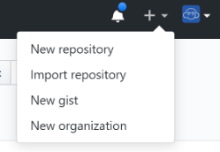
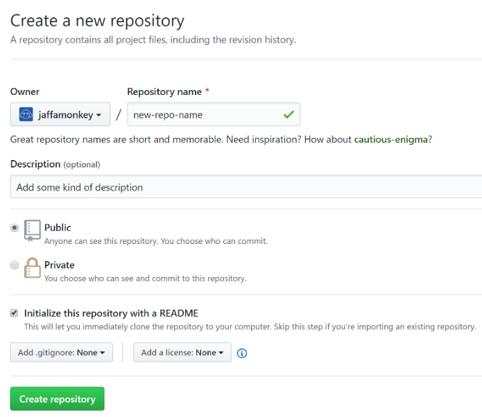
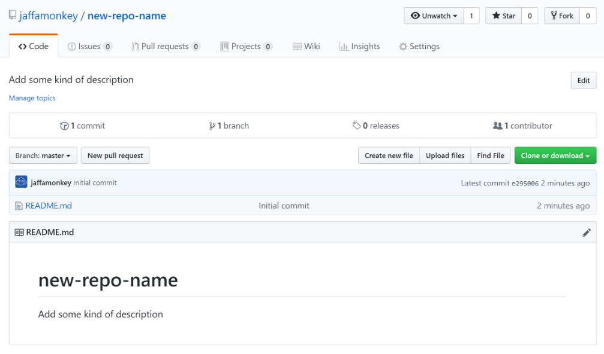
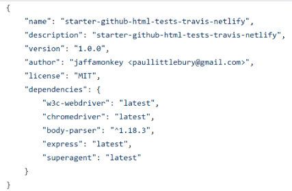
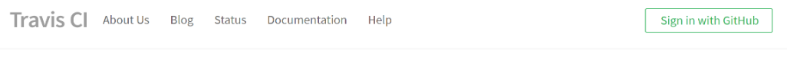
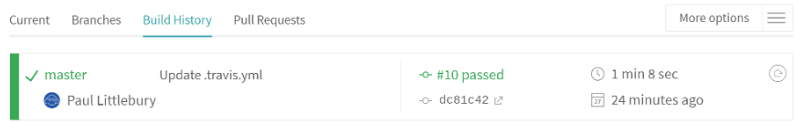
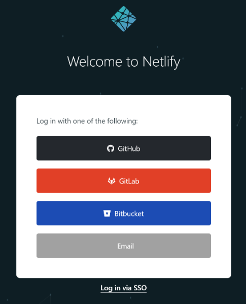
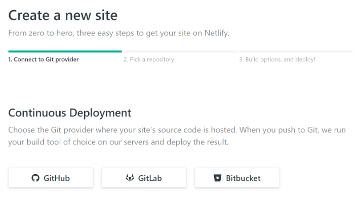
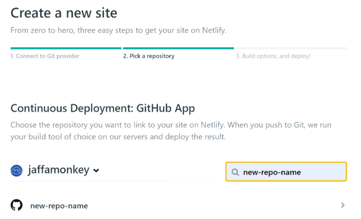
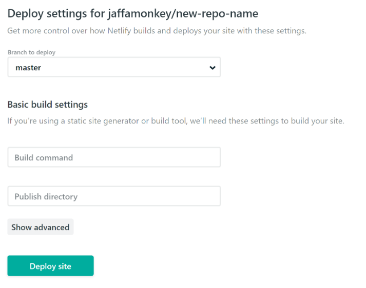

[](https://travis-ci.org/jaffamonkey/starter-github-html-tests-travis-netlify)

_Part of the "zero to vanilla web developer and test engineer" workshop (zero, as in zero prior knowledge)_

I have tried to use as few tools and helpers as possible to demonstrate a UI testing framework using only selenium-webdriver and chromedriver. And code in JavaScript, though what follows can be done in other programming languages. The only either requirement is having Node and Git installed. While you can follow this guide and edit your code purely on the github, it is far better to have a code editor on your machine. You can then push your code changes from that (see `CODING.md`)


|     |     |
| --- | --- |
| **Create a repo on github** | [Go to GitHub](https://github.com) |
| Github is a service where you can keep your code, and make it available to others. After setting up your account, click the "+" symbol in the top-right of the menu bar. |  |
| **Fill in repo form** ||
| The defaults are ok, but remember to select to add README to add repo info. |  |
| **Create first HTML page** ||
| After creating repo, click "Create New File". |  |
| **Add HTML** ||
| After adding the code, click "Commit Changes" at the end of the form to save it. |  |
| **Set up the test Framework** ||
|For convenience to install packages, it is better to create a file `package.json` in the root of your repo, like shown here, then run `npm install`. |  |

# The test file

Create a new file in 'tests' folder called `test.js`. When this code is run, it first fires up Chromes browser, then excecutes the actions in the script.

## A very important note

Don't try and process all the lines at once, guaranteed brain-freeze. Look at each line, and check if you can actually work out what the line is doing. If you don't know, go to the next line and so on. You will probably find that by doing this way, previous lines that were a mystery suddenly become clearer. 

Things to remember:
* It's just another language
* You will recognise parts because of your existing general language knowledge
* Some times its a natural language word (e.g. "try") with a loose association with the orginal meaning, i.e. not a way you would talk in normal conversation.
* Think of this as more of a puzzle (sometimes just mathem
atics)
* Some times there are parts of coding you will need to look up or be told.

Asn a start, this line will mean Chrome will run the automated tests without UI (good for speed). `headless` means no browser will be visible on screen. `disable-gpu` means disable graphics acceleration for Chrome.

```
chromeOptions: {
          args: ["headless", "disable-gpu"]
        }
```

Omit this chunk of code, to see the test run in an actual browser

```
require('chromedriver');
var webdriver = require('selenium-webdriver'),
  By = webdriver.By,
  until = webdriver.until;

driver = new webdriver
  .Builder()
  .usingServer()
  .withCapabilities({
    'browserName': 'chrome',
    'chromeOptions': {
      args: ["headless", "disable-gpu"]
    }
  }).build();

driver.get('http://localhost:8081');

// waiting for element to load, the fill in field
driver.wait(until.elementLocated(By.name('q')), 10000, 'Could not locate').sendKeys('donald trump simulator');

// Locating the field that has name "search", then clicking
driver.wait(until.elementLocated(By.name('search')), 10000, 'Could not locate').click();
driver.wait(until.elementLocated(By.css('.result__snippet')), 10000, 'Could not locate');

var textPromise = driver.findElement(By.css('.result__snippet')).getText();
textPromise.then((text) => {
  console.log(text);
});
```
# Too much too soon!

This can look more daunting, but the test code is mostly standard setup, though if you are new to this, it can look daunting. Don't worry! We all learn in steps, and most of this code is either standard setup or common predefined functions.  What you will be glad to know, is there are many tools available to simplify the code you write tests in.

### Some examples explained

##### Open up url and wait for it to load

`await session.go('http://your-netlify-web-address');`

##### Find the element on web page with tag "a", and give it the name "ëlement"

`const element = await session.findElement('css selector', 'a');`

##### When element has been found, click it

`await element.click();`

# Run the tests

#### Start the website environment up

Open new Terminal tab
```
// This starts the Node web server
node ./web/server.js
```

#### Start the chromedriver (now ready to automate browser actions)

Open new Terminal tab
```
your-repo-name>cd tests
your-repo-name/tests>./node_modules/.bin/chromedriver
```
#### Now run the tests
```
your-repo-name/tests>node test.js
```

# Branching

At this point we have been working on the default `master` branch, but in order to make sure we have a stable pipeline it is better to do work and test on a separate branch. 

So now create a branch called `travis-ci`, which will be used by Travis CI

# Travis Build Server [Go to TravisCI](https://travis-ci.org)

Now we have the code, we need the run the tests each time the code changes, to make sure our changes don't break it. The tests we currently start manually, but using a build server service, like Travis, these can be run automatically every time you change your code. Basically all we have to do, is take the exact steps you did in the previous section, and put them into the simple Travis configuration file format.




# The Travis file

We need to write small configuration file, so that when Travis pulls the code from your GitHub repo, it knows what to do.

The file is very simple for us, so create new file in your repo called `.travis.yml`

```
sudo: required // Some installation actions require administrator-level access

dist: trusty // Builds a mininal machine to runs tests on

addons:
  chrome: stable // installs latest stable Chrome

language: node_js // define primary platform language

node_js:
  - '11' // define primary platform language version
  
branches:
  only:
  - travis-ci // Specifies that only the 'travis-ci' branch will be used
  
before_script:
  - npm install selenium-webdriver // install selenium-webdriver to use browser from DOM level
  - npm install chromedriver // install chromedriver, the browser interaction service for Chrome
  - ./node_modules/.bin/chromedriver & // Run the browser interaction service
  
script:
  - node test.js // run the tests
```
# After build

After build has completed. it will either Pass for Fail



# Activate Travis build for your repo

Go to your dashboard and search for your repo

Then move switch on right so it turns green - your repo will now run through and build and test every time you change your code on GitHub.


# Activate Travis build badge to your README
Add the following code to your README, and it will display the lastest Travis status for your code:

```
[![Build Status]
(https://travis-ci.org/replace-this-with-your-github-userid/replace-this-with-your-repo-name.svg?branch=master)]
(https://travis-ci.org/replace-this-with-your-github-userid/replace-this-with-your-repo-name)
```

# CI

Now we know out build works on the build server, it's time to deploy to Netlify, using our `master`, so now we need to do a Pull Request from the `travis-ci` branch, which when merged will trigger a deploy to Netlify (we are now going to set that up).

**Strictly this would not be a deployment to live website (which I am doing here for simplicity), it would be a deployment to a test website so we can check things visually before manually deploying to live website.**

# Netlify

Now log into https://app.netlify.com (you can use your GitHub account to do this)



# Create new GitHub repo connection

Click the "New site from Git" button, then click "GutHub" button (which will create connection between netlify and GitHub)



# Create new deployment

Type in your repo name into search, then click on the repo link



# Deploy The Site

Leave defaults, and click "Deploy site"



# Deploy history

Below is the output from the Netlify process to make you site live

```
1:32:38 AM: Waiting to build. Currently running 1 concurrent builds on your account
1:32:38 AM: Build ready to start
1:32:40 AM: build-image version: 324ec043422499a87b63cac1f1dabeefe6dca19d
1:32:40 AM: build-image tag: v3.0.2
1:32:40 AM: buildbot version: ef2e26260c41679f4cdeaebbf93370345c9fecf7
1:32:40 AM: Fetching cached dependencies
1:32:40 AM: Failed to fetch cache, continuing with build
1:32:40 AM: Starting to prepare the repo for build
1:32:41 AM: No cached dependencies found. Cloning fresh repo
1:32:41 AM: git clone https://github.com/jaffamonkey/new-repo-name
1:32:41 AM: Preparing Git Reference refs/heads/master
1:32:42 AM: No build command found, continuing to publishing
1:32:42 AM: Starting to deploy site from '/'
1:32:42 AM: Creating deploy tree 
1:32:42 AM: 2 new files to upload
1:32:42 AM: 0 new functions to upload
1:32:42 AM: Starting post processing
1:32:42 AM: Post processing done
1:32:43 AM: Site is live
```
# The code

The code for this workshop is on github:

[GitHub Workshop Repo](https://github.com/jaffamonkey/starter-github-html-tests-travis-netlify "GitHub Workshop Repo")
