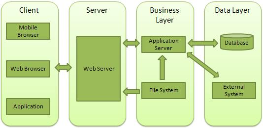

# Web Architecture

## Client

This layer consists of web browsers, mobile browsers or applications which can make HTTP requests to the web server.

### To run the client (another way to get a webpage)
```
node ./web/client.js
```

## Server

This layer has the Web server which can intercept the requests made by the clients and pass them the response.

### To run the web server (so you can view the html page)
```
node ./web/server.js
```

## Business

### To run the application server
```
node ./web/main.js
```

## Data

This layer contains the databases or any other source of data.


