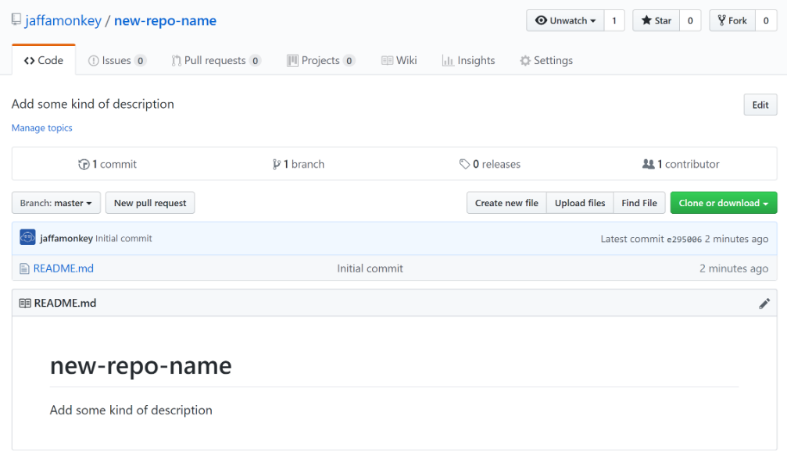
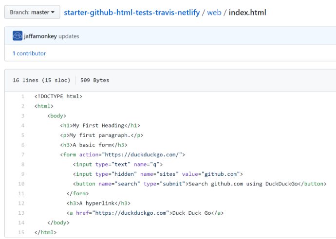
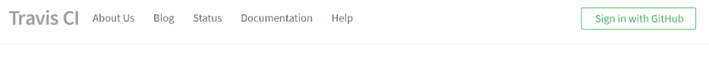
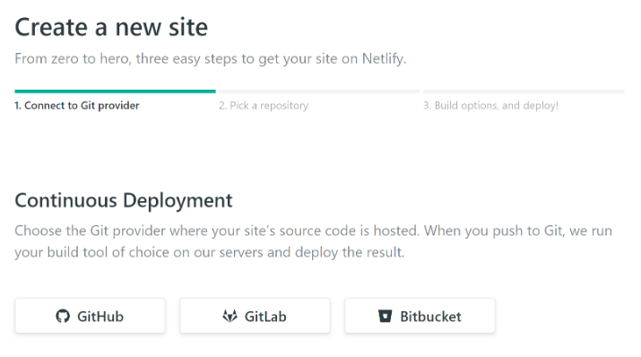
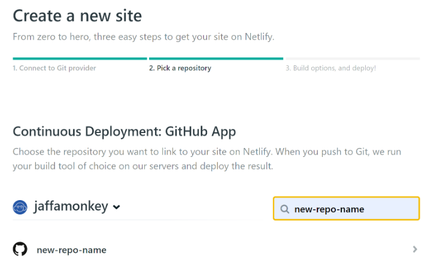

_Part of the "zero to vanilla web developer and test engineer" workshop (zero, as in zero prior knowledge)_

I have tried to use as few tools and helpers as possible to demonstrate a UI testing framework using only selenium-webdriver and chromedriver. And coding will be in JavaScript, though what follows can be done in other programming languages. The only either requirement is having Node and Git installed.

The assumption is you have set up accounts on Github - you can use you GitHub credentials to login to both Travis-CI and Netlify when the time comes.

While it will be important to understand running commands from a Terminal, for this training guide, using the web services will be sufficient.

GitHub
====== 
 
GitHub is a code hosting platform for version control and collaboration. It lets you and others work together on projects from anywhere.

## Create a repo on github
[Go to GitHub](https://github.com)

Github is a service where you can keep your code, and make it available to others. After setting up your account, click the "+" symbol in the top-right of the menu bar.


## Fill in repo form

The defaults are ok, but remember to select to add README to add repo info.


Webpage
=======

## Create first HTML page

After creating repo, click "Create New File" and enter filename `index.html`



## Add HTML

After adding the code, click "Commit Changes" at the end of the form to save it.



Now we have a basic web page to test on!

Testing
=======

## What to test?

On software development projects, testing work is driven by what the client has asked for.  

This is a continual process that never stops, and it's important the tests reflect this. 

However this not not mean testers do not manually test - on the contrary, due to the nature of UI test automation, work is constantly validated.

In further training I will go into the other sides of test automation (such as load and security testing) in future training guides.

But also it's important to remember to think creatively, and develop other useful tests (this is where developers can help you out, and will be more than happy to!).

What many testers forget, is that most developers welcome dialogue with testers, as they know how helpful they can be.

## Set up the testing framework

For convenience to install packages, it is better to create a file `package.json` in the root of your repo, like shown here, then run `npm install`.

 |

## The test file

Although the purpose of tests varies, the context is similar:

1. I do something
2. Something happens

So test steps are (simplified) an action followed by consequence(s) - the consequence is how we verify is a test has passed or failed.

Create a new file in 'tests' folder called `test.js`. When this code is run, it first fires up Chromes browser, then excecutes the actions in the script.

As a start, this line will mean Chrome will run the automated tests without UI (good for speed). `headless` means no browser will be visible on screen. `disable-gpu` means disable graphics acceleration for Chrome.

```
// Include chromedriver
require('chromedriver');

// The easiest way to look at this, is it's creating an object that's webdriver.
var webdriver = require('selenium-webdriver'),
  By = webdriver.By,
  until = webdriver.until;

// This is creating an object that is the browser
const browser = new webdriver
  .Builder()
  .usingServer()
  .withCapabilities({
    'browserName': 'chrome',
    'chromeOptions': {
      args: ["headless", "disable-gpu"]
    }
  }).build();


try {
  // This line is telling the browser to open a url.
  browser.get('http://localhost:8081');

  // Now the search field is filled in with our search terms, after the field becomes visible (allowing for page load time).
  browser.wait(until.elementLocated(By.name('q')), 3000, 'Could not locate the search field').sendKeys('donald trump simulator');

  // Now we click the search button, after the button becomes visible.
  browser.wait(until.elementLocated(By.id('searchButton')), 3000, 'Could not locate the search button').click();

  // This looks for a link text that includes "Trumpklon", which is the expected result.
  browser.wait(until.elementLocated(By.partialLinkText('TrumpKlon')), 3000, 'Could not locate correct link');

  // Now checking that the page title is what is expected.
  browser.wait(until.titleIs('donald trump simulator site:github.com at DuckDuckGo'), 3000, 'Could not locate correct title').then(() => {

    // Output success message to screen. For this to happens if the previous steps have all run successfully.
    console.log('Browser test passed!');
  })
}
finally {

  // Close all of the open browser windows, then stop chromedriver.
  browser.quit();
}
```
## Too much too soon!

This can look more daunting, but the test code is mostly standard setup, though if you are new to this, it can look daunting. Don't worry! We all learn in steps, and most of this code is either standard setup or common predefined functions.  What you will be glad to know, is there are many tools available to simplify the code you write tests in.

### Some examples explained

**Open up url**
```
browser.get('http://localhost:8081');
```
**Wait for field to be visible, then fill in field with a value***
```
browser.wait(until.elementLocated(By.name('q')), 10000, 'Could not locate').sendKeys('donald trump simulator');
```
**Locating the element that has name "search", then click**
```
browser.wait(until.elementLocated(By.name('search')), 10000, 'Could not locate').click();
```
**Wait for search results to load**
```
browser.wait(until.elementLocated(By.css('.result__snippet')), 10000, 'Could not locate');
```

## Run the tests

#### Start the website environment up

Open new Terminal tab
```
// This starts the Node web server
node ./web/server.js
```

#### Start the chromedriver (now ready to automate browser actions)

Open new Terminal tab
```
your-repo-name>cd tests
your-repo-name/tests>./node_modules/.bin/chromedriver
```
#### Now run the tests
```
your-repo-name/tests>node test.js
```

## Branching

At this point we have been working on the default `master` branch, but in order to make sure we have a stable pipeline it is better to do work and test on a separate branch. 

So now create a branch called `travis-ci`, which will be used by Travis CI

* Go to your new repository
* Click the drop down at the top of the file list that says branch: master.
* Type a branch name, readme-edits, into the new branch text box.
* Select the blue Create branch box or hit “Enter” on your keyboard.

Travis Build Server
===================

[Go to TravisCI](https://travis-ci.org)

A build server (also called a continuous integration server (CI server)), is a centralized, stable and reliable environment for building software.

Developers on projects use the build server all the time, as it's the place that their code is built and tested.

Now we have the code, we need the run the tests each time the code changes, to make sure our changes don't break it. 

The tests we currently start manually, but using a build server service, like Travis, these can be run automatically every time you change your code. 

Basically all we have to do, is take the exact steps you did in the previous section, and put them into the simple Travis configuration file format.




## The Travis file

We need to write small configuration file, so that when Travis pulls the code from your GitHub repo, it knows what to do.

The file is very simple for us, so create new file in your repo called `.travis.yml`

```
sudo: required // Some installation actions require administrator-level access
dist: trusty // Builds a mininal machine to runs tests on

addons:
  chrome: stable // installs latest stable Chrome

language: node_js // define primary platform language

node_js:
  - '11' // define primary platform language version
  
branches:
  only:
  - travis-ci // Specifies that only the 'travis-ci' branch will be used
  
before_script:
  - npm install selenium-webdriver // install selenium-webdriver to use browser from DOM level
  - npm install chromedriver // install chromedriver, the browser interaction service for Chrome
  - ./node_modules/.bin/chromedriver & // Run the browser interaction service
  
script:
  - node test.js // run the tests
```

After these steps are all in your code, and committed, a build process will automatically start on TravisCI

## After build

After build has completed. it will either Pass for Fail


## Activate Travis build for your repo

Go to your dashboard and search for your repo

Then move switch on right so it turns green - your repo will now run through and build and test every time you change your code on GitHub.


## Activate Travis build badge to your README
Add the following code to your README, and it will display the lastest Travis status for your code:

```
[![Build Status]
(https://travis-ci.org/replace-this-with-your-github-userid/replace-this-with-your-repo-name.svg?branch=master)]
(https://travis-ci.org/replace-this-with-your-github-userid/replace-this-with-your-repo-name)
```

Deployment
=======

Now we know out build works on the build server, it's time to deploy to Netlify, using our `master`, so now we need to do a Pull Request from the `travis-ci` branch, which when merged will trigger a deploy to Netlify (we are now going to set that up).

**Strictly this would not be a deployment to live website (which I am doing here for simplicity), it would be a deployment to a test website so we can check things visually before manually deploying to live website.**

## Netlify

Now log into https://app.netlify.com (you can use your GitHub account to do this)


## Create new GitHub repo connection

Click the "New site from Git" button, then click "GutHub" button (which will create connection between netlify and GitHub)



## Create new deployment

Type in your repo name into search, then click on the repo link



## Deploy The Site

Leave defaults, and click "Deploy site"


## Deploy history

Below is the output from the Netlify process to make you site live

```
1:32:38 AM: Waiting to build. Currently running 1 concurrent builds on your account
1:32:38 AM: Build ready to start
1:32:40 AM: build-image version: 324ec043422499a87b63cac1f1dabeefe6dca19d
1:32:40 AM: build-image tag: v3.0.2
1:32:40 AM: buildbot version: ef2e26260c41679f4cdeaebbf93370345c9fecf7
1:32:40 AM: Fetching cached dependencies
1:32:40 AM: Failed to fetch cache, continuing with build
1:32:40 AM: Starting to prepare the repo for build
1:32:41 AM: No cached dependencies found. Cloning fresh repo
1:32:41 AM: git clone https://github.com/jaffamonkey/new-repo-name
1:32:41 AM: Preparing Git Reference refs/heads/master
1:32:42 AM: No build command found, continuing to publishing
1:32:42 AM: Starting to deploy site from '/'
1:32:42 AM: Creating deploy tree 
1:32:42 AM: 2 new files to upload
1:32:42 AM: 0 new functions to upload
1:32:42 AM: Starting post processing
1:32:42 AM: Post processing done
1:32:43 AM: Site is live
```
# The code

The code for this workshop is on github:

[GitHub Workshop Repo](https://github.com/jaffamonkey/starter-github-html-tests-travis-netlify "GitHub Workshop Repo")
